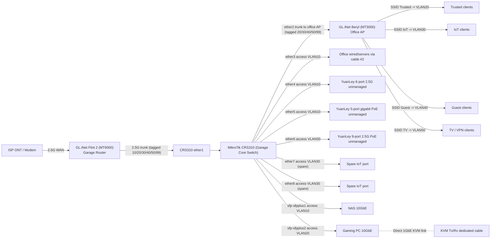

# Garage and Office Topology

This topology keeps routing/firewall/VPN on the garage `gateway-router` (MT6000), uses `ap-repeater` (MT3000) in the office for Wi-Fi, and uses CRS310 for VLAN-aware switching.

## Device roles

- `gateway-router` (GL.iNet Flint 2, garage rack): WAN, inter-VLAN routing, DHCP, firewall, VPN policy.
- `ap-repeater` (GL.iNet Beryl, office): AP bridge only, no NAT/DHCP, SSIDs for VLAN 20/30/40/50.
- `switches` (MikroTik CRS310, garage rack): trunk and access VLAN distribution.

## VLAN plan

- `10` servers
- `20` trusted
- `30` iot
- `40` guest
- `50` tv_vpn
- `99` management

## Port mapping

- MT6000 `WAN` -> ISP ONT/modem.
- MT6000 `LAN` trunk -> CRS310 `ether1` (tagged VLAN 10/20/30/40/50/99, no native VLAN).
- CRS310 `ether2` trunk -> office MT3000 uplink over cable #1 (tagged VLAN 20/30/40/50/99, no native VLAN).
- CRS310 `ether3` access VLAN 10 -> office wired devices or servers over cable #2.
- CRS310 `ether4` access VLAN 10 -> YuanLey 6-port 2.5G unmanaged (rack compute segment).
- CRS310 `ether5` access VLAN 10 -> YuanLey 5-port gigabit PoE unmanaged (Raspberry Pi PoE segment).
- CRS310 `ether6` access VLAN 30 -> YuanLey 9-port 2.5G PoE unmanaged (IoT/cameras segment).
- CRS310 `ether7` and `ether8` access VLAN 30 (spare IoT/camera ports).
- CRS310 `sfp-sfpplus1` access VLAN 10 -> NAS 10GbE.
- CRS310 `sfp-sfpplus2` access VLAN 20 -> gaming PC 10GbE.
- Gaming PC 1GbE NIC -> direct KVM Tx/Rx cable path (isolated, non-routed link).

## AP SSID mapping

- Trusted SSID -> VLAN 20
- IoT SSID -> VLAN 30
- Guest SSID -> VLAN 40
- TV SSID -> VLAN 50

No SSID is mapped to VLAN 10 or VLAN 99.

## Redundant devices

- MT6000 Wi-Fi radios broadcast fallback SSIDs (MM_TV on VLAN 50, MM_SRV on VLAN 10, MM_MGMT on VLAN 99 via physical switch).
- One unmanaged switch tier may be removable later if port count and PoE budget permit consolidation.
- Unmanaged switches must remain single-VLAN access segments only; do not place mixed VLAN trunks through them.

## Mermaid topology

